This document provides technical documentation for the E-commerce Backend REST API built with Spring Boot. The API provides functionality for product management, shopping cart operations, order processing, and user authentication.


# 🌟 Features

### E-commerce Functionality

- **Product Management**: The application allows for the management of products, including adding new products, updating product information, and deleting products.


- **Product Search**: Users can search for products by various criteria, including name, brand, category, or a combination of these attributes.


- **Shopping Cart**: Users can add products to a shopping cart, update the quantity of items in the cart, and remove items from the cart.


- **Order Placement**: Users can place orders for items in their shopping cart.


- **Order Management**: The application allows for the management of orders, including tracking their status.


- **Image Management**: Products can have multiple images associated with them, which can be uploaded, stored, and retrieved.


- **Category Management**: Products can be categorized, and the application provides features for managing these categories.

### Security

- **User Authentication**: The application uses JWT (JSON Web Token) for authentication, requiring users to log in to access certain features.


- **User Authorization**: Different roles are defined in the application (e.g., admin, user), and access to specific features is controlled based on the user's role.


- **BCrypt hashing**: Passwords are securely hashed before storage. No plain text password storage

### Data Management

- **Database Integration**: The application uses a database (MySQL in the example) to store product information, user data, shopping cart contents, and order details.


- **Spring Data JPA**: Is used to simplify database interactions, reducing the need for writing explicit SQL queries.

### Application Structure

- **Spring Boot Framework**: The application is built on Spring Boot, a framework that simplifies the development of Spring applications.


- **RESTful API**: The application exposes a RESTful API, making it accessible from various clients.


- **Layered Architecture**: The application follows a layered architecture, with controllers handling requests, services implementing business logic, and repositories interacting with the database.


- **Data Transfer Objects (DTOs)**: DTOs are used to transfer data between different layers of the application and to the client, helping to encapsulate data and improve security.

### Tech Stack
- **Spring Boot**
- **Spring Security**
- **Spring Data JPA**
- **MySQL**
- **JWT Authentication**
- **Stripe Payment Integration**


# 🚀 API Endpoints
## Base URL
`/api/v1`

## Authentication
### Login
- **URL**: `/auth/login`
- **Method**: `POST`
- **Description**: Authenticates a user and returns a JWT token
- **Request Body**:
  ```json
  {
    "email": "string",
    "password": "string"
  }
  ```
- **Response**: Returns JWT token for authenticated user

## User Management

### Register User
- **URL**: `/users/add`
- **Method**: `POST`
- **Description**: Registers a new user
- **Request Body**:
  ```json
  {
    "email": "string",
    "password": "string",
    "firstName": "string",
    "lastName": "string"
  }
  ```

### Get User Details
- **URL**: `/users/{userId}/user`
- **Method**: `GET`
- **Description**: Retrieves user details
- **Authorization**: Required
- **Path Parameters**:
   - `userId`: ID of the user

### Update User
- **URL**: `/users/{userId}/update`
- **Method**: `PUT`
- **Description**: Updates user information
- **Authorization**: Required
- **Path Parameters**:
   - `userId`: ID of the user

### Delete User
- **URL**: `/users/{userId}/delete`
- **Method**: `DELETE`
- **Description**: Delete a user account
- **Authorization**: Required
- **Path Parameters**:
   - `userId`: ID of the user

## Product Management
### Get All Products
- **URL**: `/products/all`
- **Method**: `GET`
- **Description**: Retrieves all products
- **Response**: List of products

### Get Product by ID
- **URL**: `/products/product/{productId}/product`
- **Method**: `GET`
- **Description**: Retrieves specific product details
- **Path Parameters**:
   - `productId`: ID of the product

### Add Product
- **URL**: `/products/add`
- **Method**: `POST`
- **Description**: Adds a new product
- **Authorization**: Required (ROLE_ADMIN only)
- **Request Body**:
  ```json
  {
    "name": "string",
    "brand": "string",
    "price": "number",
    "inventory": "number",
    "description": "string",
    "categoryId": "number"
  }
  ```

### Update Product
- **URL**: `/products/product/{productId}/update`
- **Method**: `PUT`
- **Description**: Updates a specific product by its ID
- **Authorization**: Required (ROLE_ADMIN only)
- **Path Parameters**:
   - `productId`: ID of the product
- **Request Body**:
  ```json
  {
    "name": "string",
    "brand": "string",
    "price": "number",
    "inventory": "number",
    "description": "string",
    "categoryId": "number"
  }
  ```

### Delete Product
- **URL**: `/products/product/{productId}/delete`
- **Method**: `DELETE`
- **Description**: Deletes a specific product by its ID
- **Authorization**: Required (ROLE_ADMIN only)
- **Path Parameters**:
   - `productId`: ID of the product

### Search Products by Brand and Name
- **URL**: `/products/products/by/brand-and-name`
- **Method**: `GET`
- **Description**: Searches products by brand and name
- **Query Parameters**:
   - `brand`: Brand name
   - `name`: Product name

### Search Products by Category and Brand
- **URL**: `/products/products/by/category-and-brand`
- **Method**: `GET`
- **Description**: Retrieves products by category ID and brand name
- **Query Parameters**:
   - `categoryId`: Category ID
   - `brand`: Brand name

### Search Products by Name
- **URL**: `/products/products/{name}/products`
- **Method**: `GET`
- **Description**: Retrieves products by product name
- **Path Parameters**:
   - `name`: Product name

### Get Products by Category
- **URL**: `/products/product/{category}/all/products`
- **Method**: `GET`
- **Description**: Retrieves products by category name
- **Path Parameters**:
   - `category`: Category name

### Get Products by Brand
- **URL**: `/products/products/by/brand`
- **Method**: `GET`
- **Description**: Retrieves products by brand name
- **Query Parameters**:
   - `brand`: Brand name

### Get Distinct Brands
- **URL**: `/products/distinct/brands`
- **Method**: `GET`
- **Description**: Retrieves all distinct brand names

### Get Distinct Products by Category
- **URL**: `/products/distinct/products`
- **Method**: `GET`
- **Description**: Retrieves distinct products by category

### Count Products by Brand and Name
- **URL**: `/products/product/count/by-brand/and-name`
- **Method**: `GET`
- **Description**: Counts products by brand and name
- **Query Parameters**:
   - `brand`: Brand name
   - `name`: Product name

## Category Management

### Get All Categories
- **URL**: `/categories/all`
- **Method**: `GET`
- **Description**: Retrieves all product categories

### Add Category
- **URL**: `/categories/add`
- **Method**: `POST`
- **Description**: Adds a new category
- **Request Body**:
  ```json
  {
    "name": "Category"
  }
  ```

### Get Category by ID
- **URL**: `/categories/category/{id}/category`
- **Method**: `GET`
- **Description**: Retrieves a specific category by its ID
- **Path Parameters**:
   - `id`: ID of the category

### Get Category by Name
- **URL**: `/categories/category/{name}/category`
- **Method**: `GET`
- **Description**: Retrieves a specific category by its name
- **Path Parameters**:
   - `name`: Name of the category

### Update Category
- **URL**: `/categories/category/{id}/update`
- **Method**: `PUT`
- **Description**: Updates a specific category by its ID
- **Authorization**: Required (ROLE_ADMIN only)
- **Path Parameters**:
   - `id`: ID of the category
- **Request Body**:
  ```json
  {
    "name": "string"
  }
  ```

### Delete Category
- **URL**: `/categories/category/{id}/delete`
- **Method**: `DELETE`
- **Description**: Deletes a specific category by its ID
- **Authorization**: Required (ROLE_ADMIN only)
- **Path Parameters**:
   - `id`: ID of the category

## Image Management
#### Upload Product Images
- **URL**: `/images/upload`
- **Method**: `POST`
- **Description**: Uploads images for a product
- **Request Params**:
   - `files`: Image files
   - `productId`: ID of the product

### Download Image
- **URL**: `/images/image/download/{imageId}`
- **Method**: `GET`
- **Description**: Downloads a specific image using its ID
- **Path Parameters**:
   - `imageId`: ID of the image

### Update Image
- **URL**: `/images/image/{imageId}/update`
- **Method**: `PUT`
- **Description**: Updates a specific image using its ID
- **Authorization**: Required
- **Content-Type**: `multipart/form-data`
- **Path Parameters**:
   - `imageId`: ID of the image
- **Form Parameters**:
   - `file`: Image file

### Delete Image
- **URL**: `/images/image/{imageId}/delete`
- **Method**: `DELETE`
- **Description**: Deletes a specific image using its ID
- **Authorization**: Required
- **Path Parameters**:
   - `imageId`: ID of the image

## Shopping Cart
### Get User's Cart
- **URL**: `/carts/user/{userId}/my-cart`
- **Method**: `GET`
- **Description**: Retrieves user's shopping cart
- **Authorization**: Required
- **Path Parameters**:
   - `userId`: ID of the user

### Clear Cart
- **URL**: `/carts/{cartId}/clear`
- **Method**: `DELETE`
- **Description**: Clears the contents of a specific cart
- **Authorization**: Required
- **Path Parameters**:
   - `cartId`: ID of the cart

### Get Cart Total Price
- **URL**: `/carts/{cartId}/cart/total-price`
- **Method**: `GET`
- **Description**: Retrieves the total amount of a specific cart
- **Authorization**: Required
- **Path Parameters**:
   - `cartId`: ID of the cart

### Add Item to Cart
- **URL**: `/cartItems/item/add`
- **Method**: `POST`
- **Description**: Adds item to shopping cart
- **Authorization**: Required
- **Request Params**:
  ```json
  {
    "productId": "number",
    "quantity": "number"
  }
  ```

### Update Cart Item
- **URL**: `/cartItems/cart/{cartId}/item/{itemId}/update`
- **Method**: `PUT`
- **Description**: Updates item quantity in cart
- **Authorization**: Required
- **Path Parameters**:
   - `cartId`: ID of the cart
   - `itemId`: ID of the item
- **Request Params**:
   - `quantity`: quantity

### Remove Cart Item
- **URL**: `/cartItems/cart/{cartId}/item/{itemId}/remove`
- **Method**: `DELETE`
- **Description**: Removes an item from a cart
- **Authorization**: Required
- **Path Parameters**:
   - `cartId`: ID of the cart
   - `itemId`: ID of the item

## Order Management

### Place Order
- **URL**: `/orders/user/place-order`
- **Method**: `POST`
- **Description**: Places a new order
- **Authorization**: Required
- **Request Param**:
  ```json
  {
    "userId": "number"
  }
  ```

### Get Order Details
- **URL**: `/orders/{orderId}/order`
- **Method**: `GET`
- **Description**: Retrieves specific order details
- **Authorization**: Required
- **Path Parameters**:
   - `orderId`: ID of the order

### Get User Orders
- **URL**: `/orders/user/{userId}/order`
- **Method**: `GET`
- **Description**: Retrieves all orders for a specific user
- **Authorization**: Required
- **Path Parameters**:
   - `userId`: ID of the user

### Create Payment Intent
- **URL**: `/orders/payment/create-payment-intent`
- **Method**: `POST`
- **Description**: Creates Stripe payment intent
- **Authorization**: Required
- **Request Body**:
   - `paymentInfo`: Payment information


# 💾 Data Models

### User Management:

- Users can have multiple roles (many-to-many)
- Each user has one cart (one-to-one)
- Users can have multiple orders (one-to-many)


### Shopping Cart:

- Cart contains multiple cart items
- Cart items reference products
- Cart maintains a total amount


### Order System:

- Orders contain multiple order items
- Order items reference products
- Orders track status and total amount


### Product Organization:

- Products belong to categories
- Products can have multiple images
- Products are referenced by both cart items and order items

## UML Class Diagram
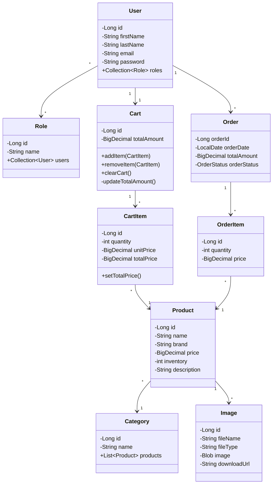
```mermaid
classDiagram
    class User {
        -Long id
        -String firstName
        -String lastName
        -String email
        -String password
        +Collection~Role~ roles
    }

    class Role {
        -Long id
        -String name
        +Collection~User~ users
    }

    class Product {
        -Long id
        -String name
        -String brand
        -BigDecimal price
        -int inventory
        -String description
    }

    class Category {
        -Long id
        -String name
        +List~Product~ products
    }

    class Image {
        -Long id
        -String fileName
        -String fileType
        -Blob image
        -String downloadUrl
    }

    class Cart {
        -Long id
        -BigDecimal totalAmount
        +addItem(CartItem)
        +removeItem(CartItem)
        +clearCart()
        -updateTotalAmount()
    }

    class CartItem {
        -Long id
        -int quantity
        -BigDecimal unitPrice
        -BigDecimal totalPrice
        +setTotalPrice()
    }

    class Order {
        -Long orderId
        -LocalDate orderDate
        -BigDecimal totalAmount
        -OrderStatus orderStatus
    }

    class OrderItem {
        -Long id
        -int quantity
        -BigDecimal price
    }

    User "1" --> "1" Cart
    User "1" --> "*" Order
    User "*" --> "*" Role
    
    Cart "1" --> "*" CartItem
    CartItem "*" --> "1" Product
    
    Order "1" --> "*" OrderItem
    OrderItem "*" --> "1" Product
    
    Product "*" --> "1" Category
    Product "1" --> "*" Image
```

## Entity-Relationship Diagram (ERD):
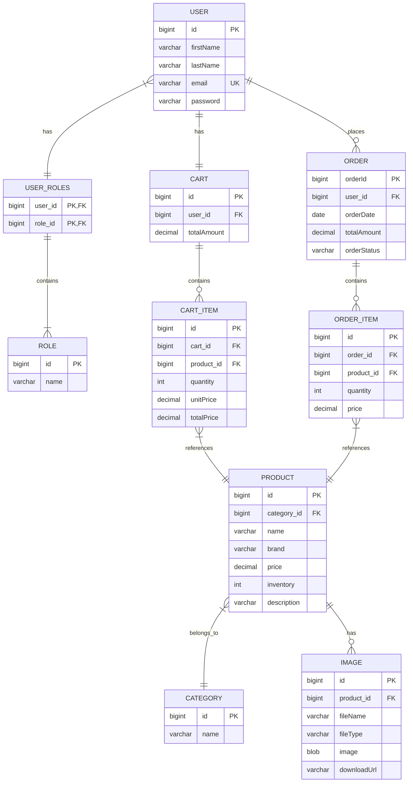
```mermaid
erDiagram
    USER ||--o{ ORDER : places
    USER ||--|| CART : has
    USER }|--|| USER_ROLES : has
    USER_ROLES ||--|{ ROLE : contains
    
    CART ||--o{ CART_ITEM : contains
    CART_ITEM }|--|| PRODUCT : references
    
    ORDER ||--o{ ORDER_ITEM : contains
    ORDER_ITEM }|--|| PRODUCT : references
    
    PRODUCT }|--|| CATEGORY : belongs_to
    PRODUCT ||--o{ IMAGE : has

    USER {
        bigint id PK
        varchar firstName
        varchar lastName
        varchar email UK
        varchar password
    }

    ROLE {
        bigint id PK
        varchar name
    }

    USER_ROLES {
        bigint user_id PK,FK
        bigint role_id PK,FK
    }

    CART {
        bigint id PK
        bigint user_id FK
        decimal totalAmount
    }

    CART_ITEM {
        bigint id PK
        bigint cart_id FK
        bigint product_id FK
        int quantity
        decimal unitPrice
        decimal totalPrice
    }

    ORDER {
        bigint orderId PK
        bigint user_id FK
        date orderDate
        decimal totalAmount
        varchar orderStatus
    }

    ORDER_ITEM {
        bigint id PK
        bigint order_id FK
        bigint product_id FK
        int quantity
        decimal price
    }

    PRODUCT {
        bigint id PK
        bigint category_id FK
        varchar name
        varchar brand
        decimal price
        int inventory
        varchar description
    }

    CATEGORY {
        bigint id PK
        varchar name
    }

    IMAGE {
        bigint id PK
        bigint product_id FK
        varchar fileName
        varchar fileType
        blob image
        varchar downloadUrl
    }

```


# 🔄  WorkFlows
## Authentication 
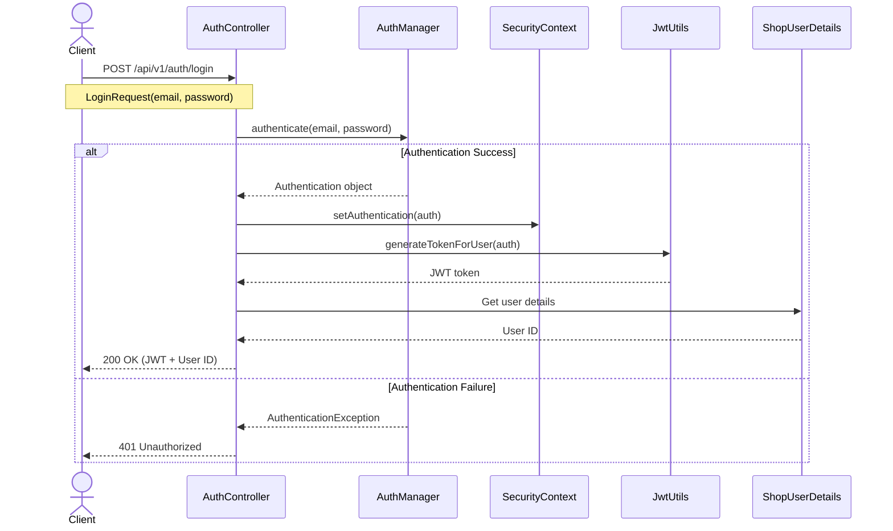
```mermaid
sequenceDiagram
    actor Client
    participant AuthController
    participant AuthManager
    participant SecurityContext
    participant JwtUtils
    participant ShopUserDetails
    
    Client->>AuthController: POST /api/v1/auth/login
    Note over Client,AuthController: LoginRequest(email, password)
    
    AuthController->>AuthManager: authenticate(email, password)
    
    alt Authentication Success
        AuthManager-->>AuthController: Authentication object
        AuthController->>SecurityContext: setAuthentication(auth)
        AuthController->>JwtUtils: generateTokenForUser(auth)
        JwtUtils-->>AuthController: JWT token
        AuthController->>ShopUserDetails: Get user details
        ShopUserDetails-->>AuthController: User ID
        AuthController-->>Client: 200 OK (JWT + User ID)
    else Authentication Failure
        AuthManager-->>AuthController: AuthenticationException
        AuthController-->>Client: 401 Unauthorized
    end
```

## User Management
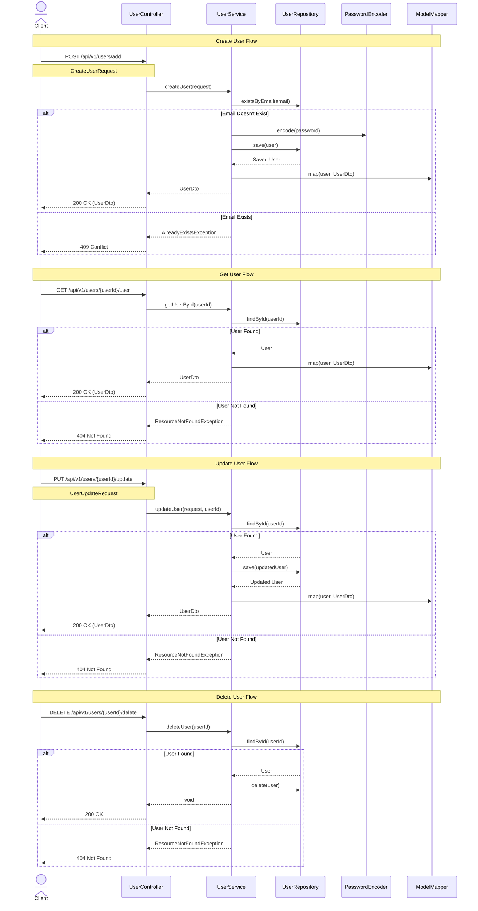
```mermaid
sequenceDiagram
    actor Client
    participant UserController
    participant UserService
    participant UserRepository
    participant PasswordEncoder
    participant ModelMapper
    
    %% Create User Flow
    rect rgb(200, 220, 240, 0)
    Note over Client,ModelMapper: Create User Flow
    Client->>UserController: POST /api/v1/users/add
    Note over Client,UserController: CreateUserRequest
    UserController->>UserService: createUser(request)
    UserService->>UserRepository: existsByEmail(email)
    
    alt Email Doesn't Exist
        UserService->>PasswordEncoder: encode(password)
        UserService->>UserRepository: save(user)
        UserRepository-->>UserService: Saved User
        UserService->>ModelMapper: map(user, UserDto)
        UserService-->>UserController: UserDto
        UserController-->>Client: 200 OK (UserDto)
    else Email Exists
        UserService-->>UserController: AlreadyExistsException
        UserController-->>Client: 409 Conflict
    end
    end

    %% Get User Flow
    rect rgb(220, 240, 200, 0)
    Note over Client,ModelMapper: Get User Flow
    Client->>UserController: GET /api/v1/users/{userId}/user
    UserController->>UserService: getUserById(userId)
    UserService->>UserRepository: findById(userId)
    
    alt User Found
        UserRepository-->>UserService: User
        UserService->>ModelMapper: map(user, UserDto)
        UserService-->>UserController: UserDto
        UserController-->>Client: 200 OK (UserDto)
    else User Not Found
        UserService-->>UserController: ResourceNotFoundException
        UserController-->>Client: 404 Not Found
    end
    end

    %% Update User Flow
    rect rgb(240, 220, 220, 0)
    Note over Client,ModelMapper: Update User Flow
    Client->>UserController: PUT /api/v1/users/{userId}/update
    Note over Client,UserController: UserUpdateRequest
    UserController->>UserService: updateUser(request, userId)
    UserService->>UserRepository: findById(userId)
    
    alt User Found
        UserRepository-->>UserService: User
        UserService->>UserRepository: save(updatedUser)
        UserRepository-->>UserService: Updated User
        UserService->>ModelMapper: map(user, UserDto)
        UserService-->>UserController: UserDto
        UserController-->>Client: 200 OK (UserDto)
    else User Not Found
        UserService-->>UserController: ResourceNotFoundException
        UserController-->>Client: 404 Not Found
    end
    end

    %% Delete User Flow
    rect rgb(240, 240, 200, 0)
    Note over Client,ModelMapper: Delete User Flow
    Client->>UserController: DELETE /api/v1/users/{userId}/delete
    UserController->>UserService: deleteUser(userId)
    UserService->>UserRepository: findById(userId)
    
    alt User Found
        UserRepository-->>UserService: User
        UserService->>UserRepository: delete(user)
        UserService-->>UserController: void
        UserController-->>Client: 200 OK
    else User Not Found
        UserService-->>UserController: ResourceNotFoundException
        UserController-->>Client: 404 Not Found
    end
    end
```

## Product Management
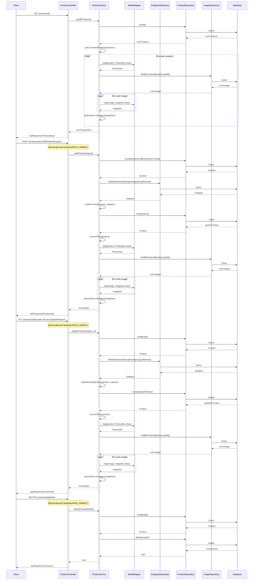
```mermaid
sequenceDiagram
    participant C as Client
    participant PC as ProductController
    participant PS as ProductService
    participant MM as ModelMapper
    participant CR as CategoryRepository
    participant PR as ProductRepository
    participant IR as ImageRepository
    participant DB as Database

    %% Get All Products Flow with DTO conversion
    C->>PC: GET /products/all
    activate PC
    PC->>PS: getAllProducts()
    activate PS
    PS->>PR: findAll()
    PR->>DB: Query
    DB-->>PR: List<Product>
    PR-->>PS: List<Product>
    
    PS->>PS: getConvertedProducts(products)
    loop For each product
        PS->>MM: map(product, ProductDto.class)
        MM-->>PS: ProductDto
        PS->>IR: findByProductId(product.getId())
        IR->>DB: Query
        DB-->>IR: List<Image>
        IR-->>PS: List<Image>
        loop For each image
            PS->>MM: map(image, ImageDto.class)
            MM-->>PS: ImageDto
        end
        PS->>PS: productDto.setImages(imageDtos)
    end
    PS-->>PC: List<ProductDto>
    PC-->>C: ApiResponse(ProductDtos)
    deactivate PS
    deactivate PC

    %% Add Product Flow with Request Mapping
    C->>PC: POST /products/add (AddProductRequest)
    note over PC: @PreAuthorize("hasRole('ROLE_ADMIN')")
    activate PC
    PC->>PS: addProduct(request)
    activate PS
    PS->>PR: existsByNameAndBrand(name, brand)
    PR->>DB: Query
    DB-->>PR: boolean
    PR-->>PS: boolean
    
    PS->>CR: findByName(request.getCategory().getName())
    CR->>DB: Query
    DB-->>CR: Category
    CR-->>PS: Category
    
    PS->>PS: createProduct(request, category)
    PS->>PR: save(product)
    PR->>DB: Insert
    DB-->>PR: Saved Product
    PR-->>PS: Product
    
    PS->>PS: convertToDto(product)
    PS->>MM: map(product, ProductDto.class)
    MM-->>PS: ProductDto
    PS->>IR: findByProductId(product.getId())
    IR->>DB: Query
    DB-->>IR: List<Image>
    IR-->>PS: List<Image>
    loop For each image
        PS->>MM: map(image, ImageDto.class)
        MM-->>PS: ImageDto
    end
    PS->>PS: productDto.setImages(imageDtos)
    
    PS-->>PC: ProductDto
    PC-->>C: ApiResponse(ProductDto)
    deactivate PS
    deactivate PC

    %% Update Product Flow with Request Mapping
    C->>PC: PUT /products/{id}/update (ProductUpdateRequest)
    note over PC: @PreAuthorize("hasRole('ROLE_ADMIN')")
    activate PC
    PC->>PS: updateProduct(request, id)
    activate PS
    PS->>PR: findById(id)
    PR->>DB: Query
    DB-->>PR: Product
    PR-->>PS: Product
    
    PS->>CR: findByName(request.getCategory().getName())
    CR->>DB: Query
    DB-->>CR: Category
    CR-->>PS: Category
    
    PS->>PS: updateExistingProduct(product, request)
    PS->>PR: save(updatedProduct)
    PR->>DB: Update
    DB-->>PR: Updated Product
    PR-->>PS: Product
    
    PS->>PS: convertToDto(product)
    PS->>MM: map(product, ProductDto.class)
    MM-->>PS: ProductDto
    PS->>IR: findByProductId(product.getId())
    IR->>DB: Query
    DB-->>IR: List<Image>
    IR-->>PS: List<Image>
    loop For each image
        PS->>MM: map(image, ImageDto.class)
        MM-->>PS: ImageDto
    end
    PS->>PS: productDto.setImages(imageDtos)
    
    PS-->>PC: ProductDto
    PC-->>C: ApiResponse(ProductDto)
    deactivate PS
    deactivate PC
    
    %%  Delete prod
    C->>PC: DELETE /products/{id}/delete
    note over PC: @PreAuthorize("hasRole('ROLE_ADMIN')")
    activate PC
    PC->>PS: deleteProductById(id)
    activate PS
    PS->>PR: findById(id)
    PR->>DB: Query
    DB-->>PR: Product
    PR-->>PS: Product

    PS->>PR: delete(product)
    PR->>DB: Delete
    DB-->>PR: Confirmation
    PR-->>PS: void
    PS-->>PC: void
    PC-->>C: ApiResponse("success")
    deactivate PS
    deactivate PC
```

### Other Product Query operations
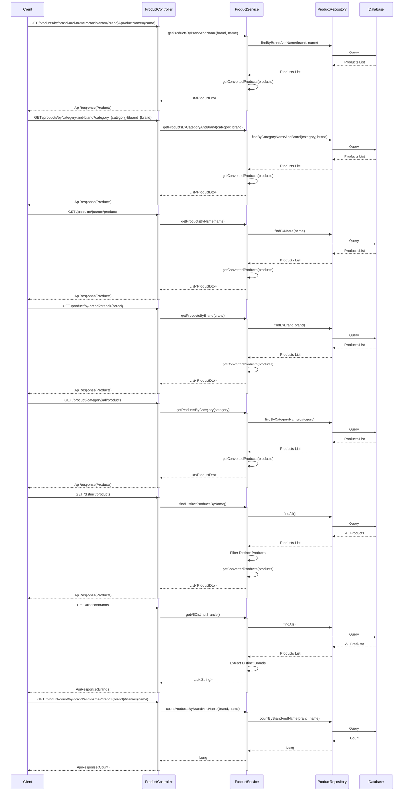
```mermaid
sequenceDiagram
    participant C as Client
    participant PC as ProductController
    participant PS as ProductService
    participant PR as ProductRepository
    participant DB as Database

    %% Query by Brand and Name
    C->>PC: GET /products/by/brand-and-name?brandName={brand}&productName={name}
    activate PC
    PC->>PS: getProductsByBrandAndName(brand, name)
    activate PS
    PS->>PR: findByBrandAndName(brand, name)
    PR->>DB: Query
    DB-->>PR: Products List
    PR-->>PS: Products List
    PS->>PS: getConvertedProducts(products)
    PS-->>PC: List<ProductDto>
    PC-->>C: ApiResponse(Products)
    deactivate PS
    deactivate PC

    %% Query by Category and Brand
    C->>PC: GET /products/by/category-and-brand?category={category}&brand={brand}
    activate PC
    PC->>PS: getProductsByCategoryAndBrand(category, brand)
    activate PS
    PS->>PR: findByCategoryNameAndBrand(category, brand)
    PR->>DB: Query
    DB-->>PR: Products List
    PR-->>PS: Products List
    PS->>PS: getConvertedProducts(products)
    PS-->>PC: List<ProductDto>
    PC-->>C: ApiResponse(Products)
    deactivate PS
    deactivate PC

    %% Query by Name
    C->>PC: GET /products/{name}/products
    activate PC
    PC->>PS: getProductsByName(name)
    activate PS
    PS->>PR: findByName(name)
    PR->>DB: Query
    DB-->>PR: Products List
    PR-->>PS: Products List
    PS->>PS: getConvertedProducts(products)
    PS-->>PC: List<ProductDto>
    PC-->>C: ApiResponse(Products)
    deactivate PS
    deactivate PC

    %% Query by Brand
    C->>PC: GET /product/by-brand?brand={brand}
    activate PC
    PC->>PS: getProductsByBrand(brand)
    activate PS
    PS->>PR: findByBrand(brand)
    PR->>DB: Query
    DB-->>PR: Products List
    PR-->>PS: Products List
    PS->>PS: getConvertedProducts(products)
    PS-->>PC: List<ProductDto>
    PC-->>C: ApiResponse(Products)
    deactivate PS
    deactivate PC

    %% Query by Category
    C->>PC: GET /product/{category}/all/products
    activate PC
    PC->>PS: getProductsByCategory(category)
    activate PS
    PS->>PR: findByCategoryName(category)
    PR->>DB: Query
    DB-->>PR: Products List
    PR-->>PS: Products List
    PS->>PS: getConvertedProducts(products)
    PS-->>PC: List<ProductDto>
    PC-->>C: ApiResponse(Products)
    deactivate PS
    deactivate PC

    %% Get Distinct Products
    C->>PC: GET /distinct/products
    activate PC
    PC->>PS: findDistinctProductsByName()
    activate PS
    PS->>PR: findAll()
    PR->>DB: Query
    DB-->>PR: All Products
    PR-->>PS: Products List
    PS->>PS: Filter Distinct Products
    PS->>PS: getConvertedProducts(products)
    PS-->>PC: List<ProductDto>
    PC-->>C: ApiResponse(Products)
    deactivate PS
    deactivate PC

    %% Get Distinct Brands
    C->>PC: GET /distinct/brands
    activate PC
    PC->>PS: getAllDistinctBrands()
    activate PS
    PS->>PR: findAll()
    PR->>DB: Query
    DB-->>PR: All Products
    PR-->>PS: Products List
    PS->>PS: Extract Distinct Brands
    PS-->>PC: List<String>
    PC-->>C: ApiResponse(Brands)
    deactivate PS
    deactivate PC

    %% Count Products by Brand and Name
    C->>PC: GET /product/count/by-brand/and-name?brand={brand}&name={name}
    activate PC
    PC->>PS: countProductsByBrandAndName(brand, name)
    activate PS
    PS->>PR: countByBrandAndName(brand, name)
    PR->>DB: Query
    DB-->>PR: Count
    PR-->>PS: Long
    PS-->>PC: Long
    PC-->>C: ApiResponse(Count)
    deactivate PS
    deactivate PC
```

## Image Management
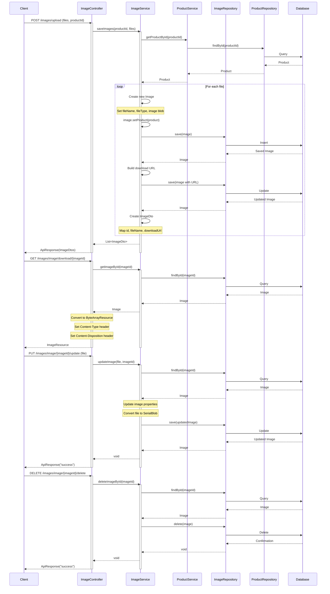
```mermaid
sequenceDiagram
    participant C as Client
    participant IC as ImageController
    participant IS as ImageService
    participant PS as ProductService
    participant IR as ImageRepository
    participant PR as ProductRepository
    participant DB as Database

    %% Upload Images Flow with DTO conversion
    C->>IC: POST /images/upload (files, productId)
    activate IC
    IC->>IS: saveImages(productId, files)
    activate IS
    IS->>PS: getProductById(productId)
    PS->>PR: findById(productId)
    PR->>DB: Query
    DB-->>PR: Product
    PR-->>PS: Product
    PS-->>IS: Product
    
    loop For each file
        IS->>IS: Create new Image
        Note over IS: Set fileName, fileType, image blob
        IS->>IS: image.setProduct(product)
        IS->>IR: save(image)
        IR->>DB: Insert
        DB-->>IR: Saved Image
        IR-->>IS: Image
        
        IS->>IS: Build download URL
        IS->>IR: save(image with URL)
        IR->>DB: Update
        DB-->>IR: Updated Image
        IR-->>IS: Image
        
        IS->>IS: Create ImageDto
        Note over IS: Map id, fileName, downloadUrl
    end
    
    IS-->>IC: List<ImageDto>
    IC-->>C: ApiResponse(ImageDtos)
    deactivate IS
    deactivate IC

    %% Download Image Flow
    C->>IC: GET /images/image/download/{imageId}
    activate IC
    IC->>IS: getImageById(imageId)
    activate IS
    IS->>IR: findById(imageId)
    IR->>DB: Query
    DB-->>IR: Image
    IR-->>IS: Image
    IS-->>IC: Image
    Note over IC: Convert to ByteArrayResource
    Note over IC: Set Content-Type header
    Note over IC: Set Content-Disposition header
    IC-->>C: ImageResource
    deactivate IS
    deactivate IC

    %% Update Image Flow with blob handling
    C->>IC: PUT /images/image/{imageId}/update (file)
    activate IC
    IC->>IS: updateImage(file, imageId)
    activate IS
    IS->>IR: findById(imageId)
    IR->>DB: Query
    DB-->>IR: Image
    IR-->>IS: Image
    
    Note over IS: Update image properties
    Note over IS: Convert file to SerialBlob
    IS->>IR: save(updatedImage)
    IR->>DB: Update
    DB-->>IR: Updated Image
    IR-->>IS: Image
    IS-->>IC: void
    IC-->>C: ApiResponse("success")
    deactivate IS
    deactivate IC

    %% Delete Image Flow
    C->>IC: DELETE /images/image/{imageId}/delete
    activate IC
    IC->>IS: deleteImageById(imageId)
    activate IS
    IS->>IR: findById(imageId)
    IR->>DB: Query
    DB-->>IR: Image
    IR-->>IS: Image

    IS->>IR: delete(image)
    IR->>DB: Delete
    DB-->>IR: Confirmation
    IR-->>IS: void
    IS-->>IC: void
    IC-->>C: ApiResponse("success")
    deactivate IS
    deactivate IC
```

## Category Management
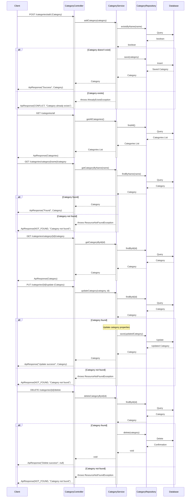
```mermaid
sequenceDiagram
    participant C as Client
    participant CC as CategoryController
    participant CS as CategoryService
    participant CR as CategoryRepository
    participant DB as Database

    %% Add Category Flow with validation
    C->>CC: POST /categories/add (Category)
    activate CC
    CC->>CS: addCategory(category)
    activate CS
    CS->>CR: existsByName(name)
    CR->>DB: Query
    DB-->>CR: boolean
    CR-->>CS: boolean
    
    alt Category doesn't exist
        CS->>CR: save(category)
        CR->>DB: Insert
        DB-->>CR: Saved Category
        CR-->>CS: Category
        CS-->>CC: Category
        CC-->>C: ApiResponse("Success", Category)
    else Category exists
        CS-->>CC: throws AlreadyExistsException
        CC-->>C: ApiResponse(CONFLICT, "Category already exists")
    end
    deactivate CS
    deactivate CC

    %% Get all Categories Flow
    C->>CC: GET /categories/all
    activate CC
    CC->>CS: getAllCategories()
    activate CS
    CS->>CR: findAll()
    CR->>DB: Query
    DB-->>CR: Categories List
    CR-->>CS: Categories List
    CS-->>CC: Categories List
    CC-->>C: ApiResponse(Categories)
    deactivate CS
    deactivate CC
    
    %% Get Category By Name
    C->>CC: GET /categories/category/{name}/category
    activate CC
    CC->>CS: getCategoryByName(name)
    activate CS
    CS->>CR: findByName(name)
    CR->>DB: Query
    DB-->>CR: Category
    CR-->>CS: Category
    alt Category found
        CS-->>CC: Category
        CC-->>C: ApiResponse("Found", Category)
    else Category not found
        CS-->>CC: throws ResourceNotFoundException
        CC-->>C: ApiResponse(NOT_FOUND, "Category not found")
    end
    deactivate CS
    deactivate CC

    %% Get Category By ID Flow
    C->>CC: GET /categories/category/{id}/category
    activate CC
    CC->>CS: getCategoryById(id)
    activate CS
    CS->>CR: findById(id)
    CR->>DB: Query
    DB-->>CR: Category
    CR-->>CS: Category
    CS-->>CC: Category
    CC-->>C: ApiResponse(Category)
    deactivate CS
    deactivate CC
    
    %% Update Category Flow with validation
    C->>CC: PUT /categories/{id}/update (Category)
    activate CC
    CC->>CS: updateCategory(category, id)
    activate CS
    CS->>CR: findById(id)
    CR->>DB: Query
    DB-->>CR: Category
    CR-->>CS: Category
    
    alt Category found
        Note over CS: Update category properties
        CS->>CR: save(updatedCategory)
        CR->>DB: Update
        DB-->>CR: Updated Category
        CR-->>CS: Category
        CS-->>CC: Category
        CC-->>C: ApiResponse("Update success!", Category)
    else Category not found
        CS-->>CC: throws ResourceNotFoundException
        CC-->>C: ApiResponse(NOT_FOUND, "Category not found")
    end
    deactivate CS
    deactivate CC

    %% Delete Category Flow
    C->>CC: DELETE /categories/{id}/delete
    activate CC
    CC->>CS: deleteCategoryById(id)
    activate CS
    CS->>CR: findById(id)
    CR->>DB: Query
    DB-->>CR: Category
    CR-->>CS: Category
    
    alt Category found
        CS->>CR: delete(category)
        CR->>DB: Delete
        DB-->>CR: Confirmation
        CR-->>CS: void
        CS-->>CC: void
        CC-->>C: ApiResponse("Delete success!", null)
    else Category not found
        CS-->>CC: throws ResourceNotFoundException
        CC-->>C: ApiResponse(NOT_FOUND, "Category not found")
    end
    deactivate CS
    deactivate CC
```


## Cart Management
### Get User Cart
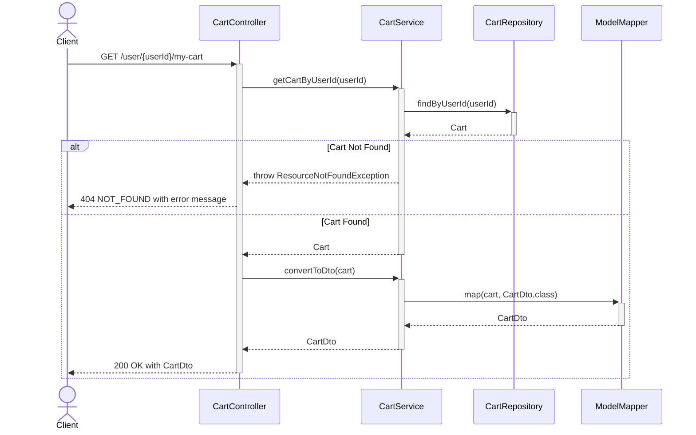
```mermaid
sequenceDiagram
    actor Client
    participant CC as CartController
    participant CS as CartService
    participant CR as CartRepository
    participant MM as ModelMapper
    
    Client->>+CC: GET /user/{userId}/my-cart
    CC->>+CS: getCartByUserId(userId)
    CS->>+CR: findByUserId(userId)
    CR-->>-CS: Cart
    
    alt Cart Not Found
        CS-->>CC: throw ResourceNotFoundException
        CC-->>Client: 404 NOT_FOUND with error message
    else Cart Found
        CS-->>-CC: Cart
        CC->>+CS: convertToDto(cart)
        CS->>+MM: map(cart, CartDto.class)
        MM-->>-CS: CartDto
        CS-->>-CC: CartDto
        CC-->>-Client: 200 OK with CartDto
    end
```

### Clear Cart
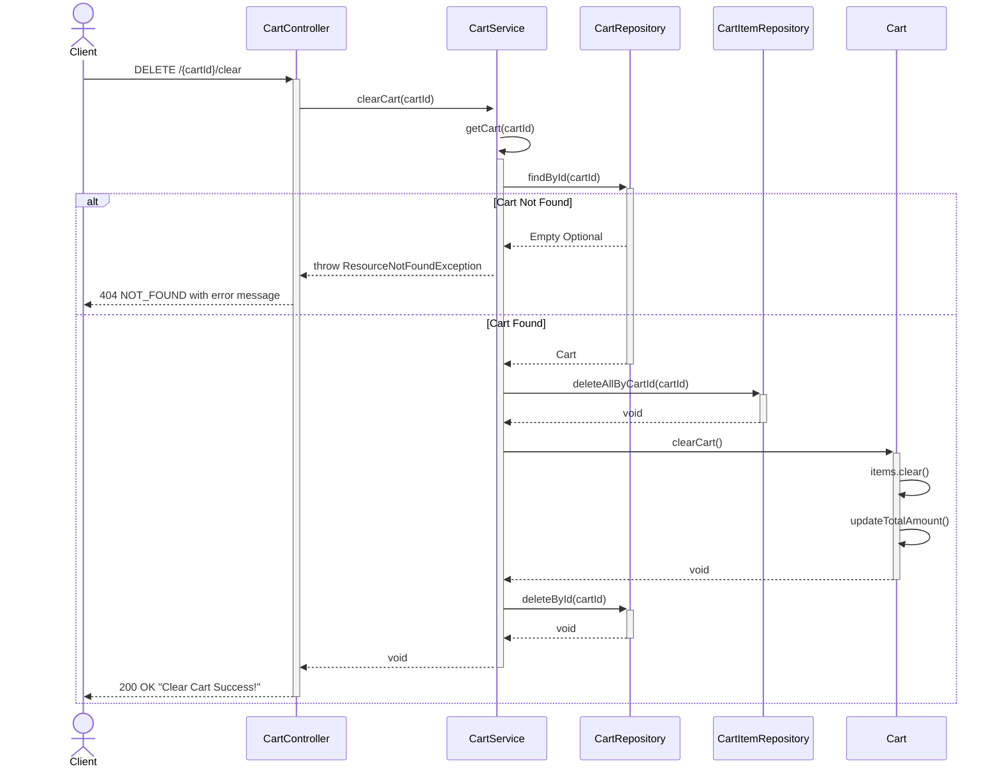
```mermaid
sequenceDiagram
    actor Client
    participant CC as CartController
    participant CS as CartService
    participant CR as CartRepository
    participant CIR as CartItemRepository
    participant Cart as Cart

    Client->>+CC: DELETE /{cartId}/clear
    CC->>+CS: clearCart(cartId)
    CS->>+CS: getCart(cartId)
    CS->>+CR: findById(cartId)
    
    alt Cart Not Found
        CR-->>CS: Empty Optional
        CS-->>CC: throw ResourceNotFoundException
        CC-->>Client: 404 NOT_FOUND with error message
    else Cart Found
        CR-->>-CS: Cart
        CS->>+CIR: deleteAllByCartId(cartId)
        CIR-->>-CS: void
        CS->>+Cart: clearCart()
        Cart->>Cart: items.clear()
        Cart->>Cart: updateTotalAmount()
        Cart-->>-CS: void
        CS->>+CR: deleteById(cartId)
        CR-->>-CS: void
        CS-->>-CC: void
        CC-->>-Client: 200 OK "Clear Cart Success!"
    end
```

### Get Cart Total Price
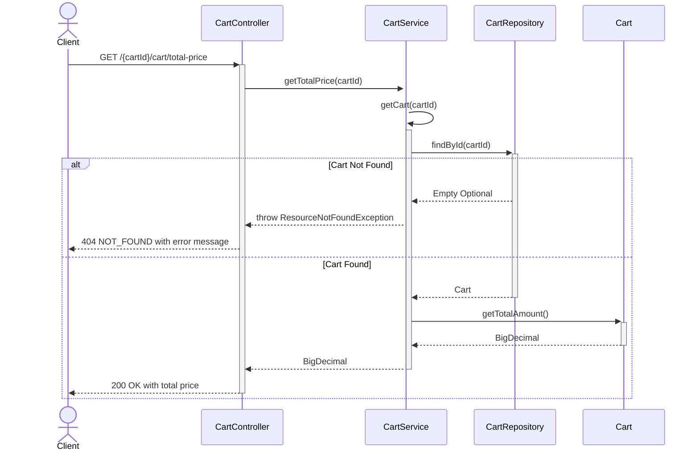
```mermaid
sequenceDiagram
    actor Client
    participant CC as CartController
    participant CS as CartService
    participant CR as CartRepository
    participant Cart as Cart

    Client->>+CC: GET /{cartId}/cart/total-price
    CC->>+CS: getTotalPrice(cartId)
    CS->>+CS: getCart(cartId)
    CS->>+CR: findById(cartId)
    
    alt Cart Not Found
        CR-->>CS: Empty Optional
        CS-->>CC: throw ResourceNotFoundException
        CC-->>Client: 404 NOT_FOUND with error message
    else Cart Found
        CR-->>-CS: Cart
        CS->>+Cart: getTotalAmount()
        Cart-->>-CS: BigDecimal
        CS-->>-CC: BigDecimal
        CC-->>-Client: 200 OK with total price
    end
```

### Add Item to Cart
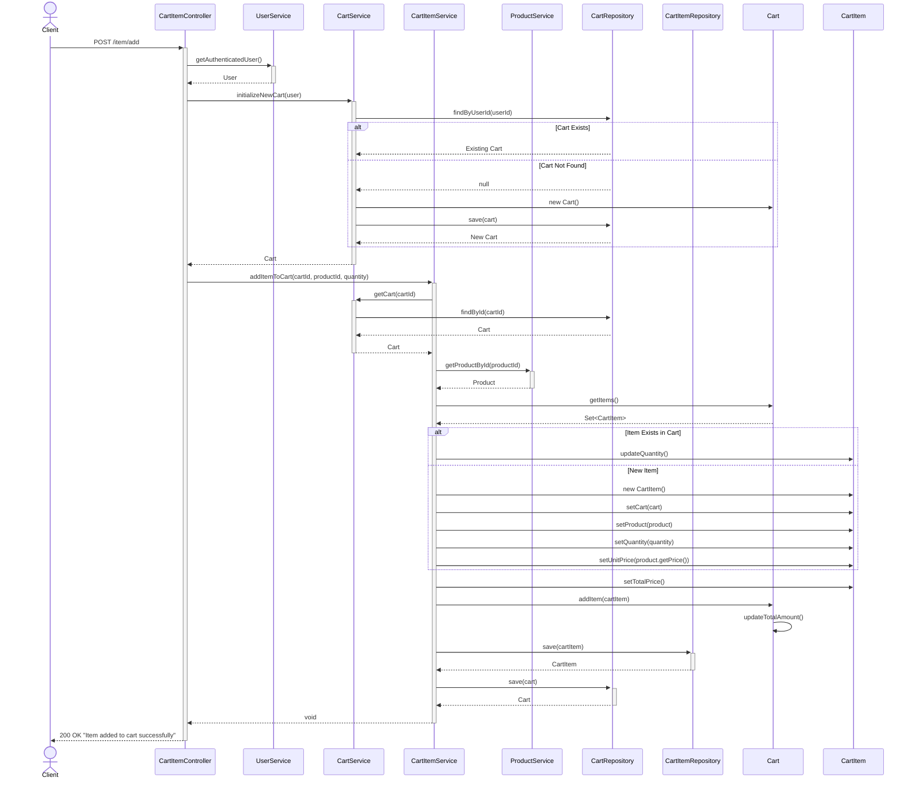
```mermaid
sequenceDiagram
    actor Client
    participant CIC as CartItemController
    participant US as UserService
    participant CS as CartService
    participant CIS as CartItemService
    participant PS as ProductService
    participant CR as CartRepository
    participant CIR as CartItemRepository
    participant Cart as Cart
    participant CartItem as CartItem

    Client->>+CIC: POST /item/add
    CIC->>+US: getAuthenticatedUser()
    US-->>-CIC: User
    CIC->>+CS: initializeNewCart(user)
    CS->>+CR: findByUserId(userId)
    
    alt Cart Exists
        CR-->>CS: Existing Cart
    else Cart Not Found
        CR-->>CS: null
        CS->>Cart: new Cart()
        CS->>CR: save(cart)
        CR-->>CS: New Cart
    end
    CS-->>-CIC: Cart

    CIC->>+CIS: addItemToCart(cartId, productId, quantity)
    CIS->>+CS: getCart(cartId)
    CS->>CR: findById(cartId)
    CR-->>CS: Cart
    CS-->>-CIS: Cart
    
    CIS->>+PS: getProductById(productId)
    PS-->>-CIS: Product

    CIS->>Cart: getItems()
    Cart-->>CIS: Set<CartItem>
    
    alt Item Exists in Cart
        CIS->>CartItem: updateQuantity()
    else New Item
        CIS->>CartItem: new CartItem()
        CIS->>CartItem: setCart(cart)
        CIS->>CartItem: setProduct(product)
        CIS->>CartItem: setQuantity(quantity)
        CIS->>CartItem: setUnitPrice(product.getPrice())
    end

    CIS->>CartItem: setTotalPrice()
    CIS->>Cart: addItem(cartItem)
    Cart->>Cart: updateTotalAmount()
    
    CIS->>+CIR: save(cartItem)
    CIR-->>-CIS: CartItem
    CIS->>+CR: save(cart)
    CR-->>-CIS: Cart
    CIS-->>-CIC: void
    
    CIC-->>-Client: 200 OK "Item added to cart successfully"
```

### Remove Item from Cart
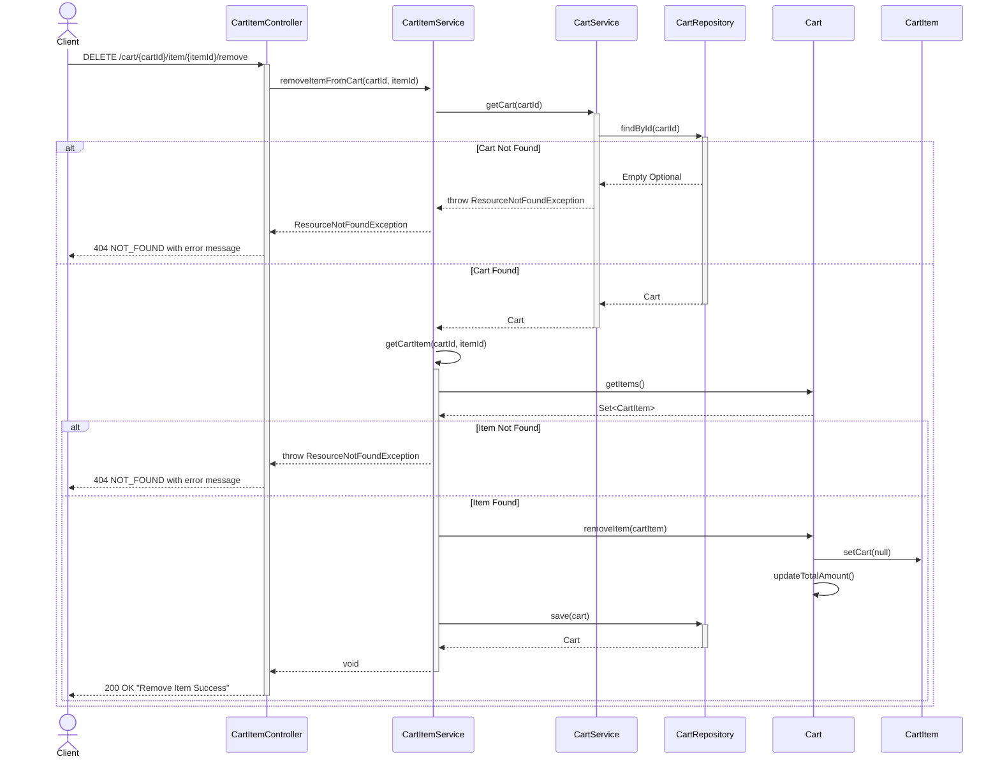
```mermaid
sequenceDiagram
    actor Client
    participant CIC as CartItemController
    participant CIS as CartItemService
    participant CS as CartService
    participant CR as CartRepository
    participant Cart as Cart
    participant CartItem as CartItem

    Client->>+CIC: DELETE /cart/{cartId}/item/{itemId}/remove
    CIC->>+CIS: removeItemFromCart(cartId, itemId)
    CIS->>+CS: getCart(cartId)
    CS->>+CR: findById(cartId)
    
    alt Cart Not Found
        CR-->>CS: Empty Optional
        CS-->>CIS: throw ResourceNotFoundException
        CIS-->>CIC: ResourceNotFoundException
        CIC-->>Client: 404 NOT_FOUND with error message
    else Cart Found
        CR-->>-CS: Cart
        CS-->>-CIS: Cart
        
        CIS->>+CIS: getCartItem(cartId, itemId)
        CIS->>Cart: getItems()
        Cart-->>CIS: Set<CartItem>
        
        alt Item Not Found
            CIS-->>CIC: throw ResourceNotFoundException
            CIC-->>Client: 404 NOT_FOUND with error message
        else Item Found
            CIS->>Cart: removeItem(cartItem)
            Cart->>CartItem: setCart(null)
            Cart->>Cart: updateTotalAmount()
            CIS->>+CR: save(cart)
            CR-->>-CIS: Cart
            CIS-->>-CIC: void
            CIC-->>-Client: 200 OK "Remove Item Success"
        end
    end
```

### Update Item Quantity
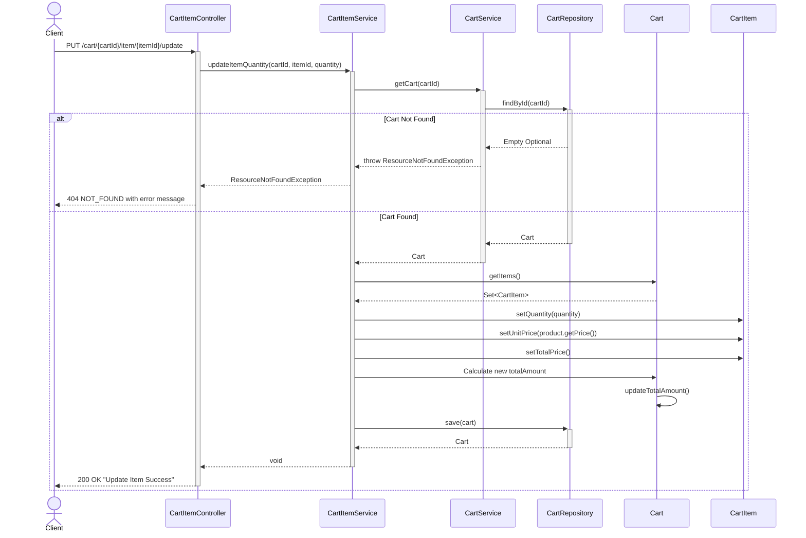
```mermaid
sequenceDiagram
    actor Client
    participant CIC as CartItemController
    participant CIS as CartItemService
    participant CS as CartService
    participant CR as CartRepository
    participant Cart as Cart
    participant CartItem as CartItem

    Client->>+CIC: PUT /cart/{cartId}/item/{itemId}/update
    CIC->>+CIS: updateItemQuantity(cartId, itemId, quantity)
    CIS->>+CS: getCart(cartId)
    CS->>+CR: findById(cartId)
    
    alt Cart Not Found
        CR-->>CS: Empty Optional
        CS-->>CIS: throw ResourceNotFoundException
        CIS-->>CIC: ResourceNotFoundException
        CIC-->>Client: 404 NOT_FOUND with error message
    else Cart Found
        CR-->>-CS: Cart
        CS-->>-CIS: Cart
        
        CIS->>Cart: getItems()
        Cart-->>CIS: Set<CartItem>
        
        CIS->>CartItem: setQuantity(quantity)
        CIS->>CartItem: setUnitPrice(product.getPrice())
        CIS->>CartItem: setTotalPrice()
        
        CIS->>Cart: Calculate new totalAmount
        Cart->>Cart: updateTotalAmount()
        
        CIS->>+CR: save(cart)
        CR-->>-CIS: Cart
        CIS-->>-CIC: void
        CIC-->>-Client: 200 OK "Update Item Success"
    end
```

## Order Management
### Place Order
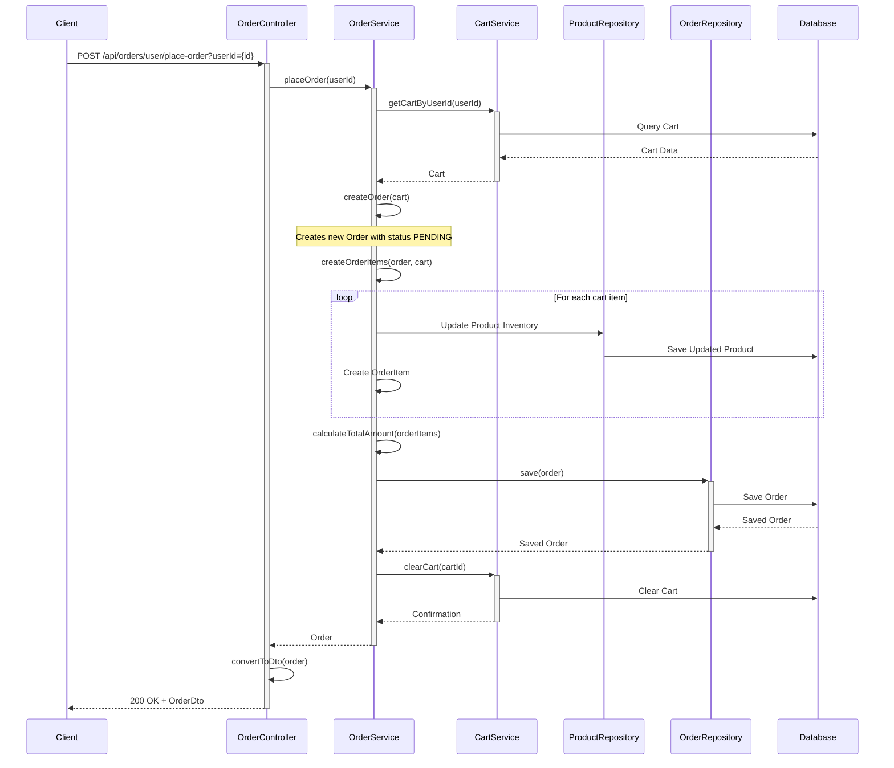
```mermaid
sequenceDiagram
    participant C as Client
    participant OC as OrderController
    participant OS as OrderService
    participant CS as CartService
    participant PR as ProductRepository
    participant OR as OrderRepository
    participant DB as Database

    C->>+OC: POST /api/orders/user/place-order?userId={id}
    OC->>+OS: placeOrder(userId)
    OS->>+CS: getCartByUserId(userId)
    CS->>DB: Query Cart
    DB-->>CS: Cart Data
    CS-->>-OS: Cart

    OS->>OS: createOrder(cart)
    Note over OS: Creates new Order with status PENDING

    OS->>OS: createOrderItems(order, cart)
    
    loop For each cart item
        OS->>PR: Update Product Inventory
        PR->>DB: Save Updated Product
        OS->>OS: Create OrderItem
    end

    OS->>OS: calculateTotalAmount(orderItems)
    
    OS->>+OR: save(order)
    OR->>DB: Save Order
    DB-->>OR: Saved Order
    OR-->>-OS: Saved Order

    OS->>+CS: clearCart(cartId)
    CS->>DB: Clear Cart
    CS-->>-OS: Confirmation

    OS-->>-OC: Order
    OC->>OC: convertToDto(order)
    OC-->>-C: 200 OK + OrderDto
```

### Get Order By ID
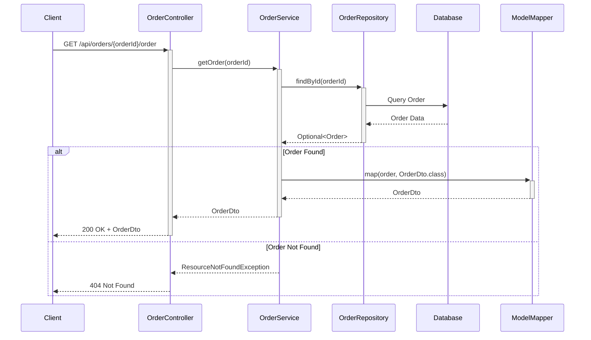
```mermaid
sequenceDiagram
    participant C as Client
    participant OC as OrderController
    participant OS as OrderService
    participant OR as OrderRepository
    participant DB as Database
    participant MM as ModelMapper

    C->>+OC: GET /api/orders/{orderId}/order
    OC->>+OS: getOrder(orderId)
    OS->>+OR: findById(orderId)
    OR->>DB: Query Order
    DB-->>OR: Order Data
    OR-->>-OS: Optional<Order>

    alt Order Found
        OS->>+MM: map(order, OrderDto.class)
        MM-->>-OS: OrderDto
        OS-->>-OC: OrderDto
        OC-->>-C: 200 OK + OrderDto
    else Order Not Found
        OS-->>OC: ResourceNotFoundException
        OC-->>C: 404 Not Found
    end
```


### Get User Orders
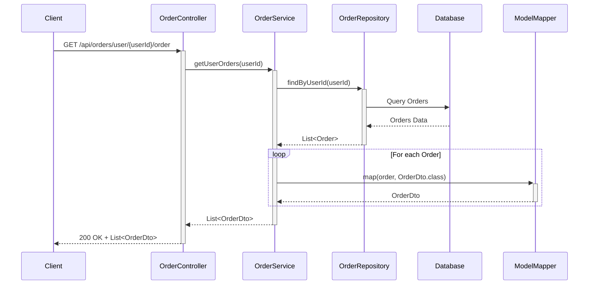
```mermaid
sequenceDiagram
    participant C as Client
    participant OC as OrderController
    participant OS as OrderService
    participant OR as OrderRepository
    participant DB as Database
    participant MM as ModelMapper

    C->>+OC: GET /api/orders/user/{userId}/order
    OC->>+OS: getUserOrders(userId)
    OS->>+OR: findByUserId(userId)
    OR->>DB: Query Orders
    DB-->>OR: Orders Data
    OR-->>-OS: List<Order>

    loop For each Order
        OS->>+MM: map(order, OrderDto.class)
        MM-->>-OS: OrderDto
    end

    OS-->>-OC: List<OrderDto>
    OC-->>-C: 200 OK + List<OrderDto>
```


### Create Payment intent
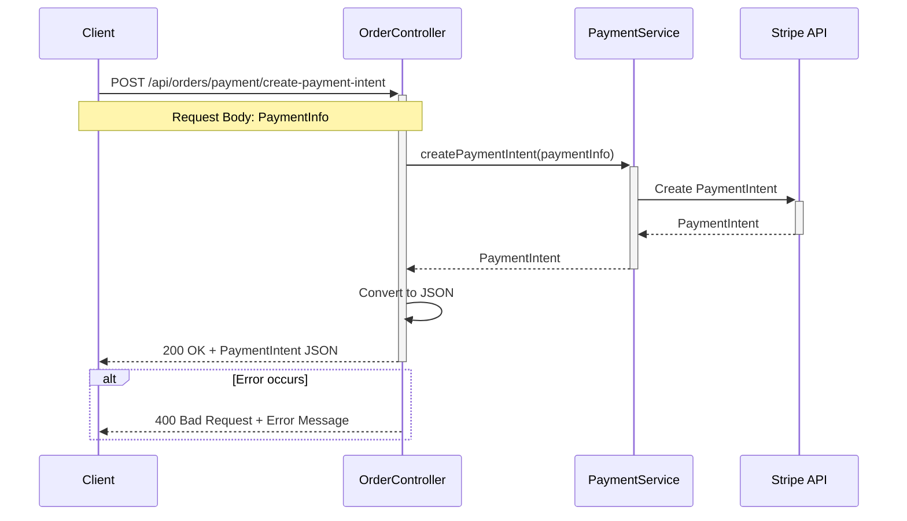
```mermaid
sequenceDiagram
    participant C as Client
    participant OC as OrderController
    participant PS as PaymentService
    participant Stripe as Stripe API

    C->>+OC: POST /api/orders/payment/create-payment-intent
    Note over C,OC: Request Body: PaymentInfo
    
    OC->>+PS: createPaymentIntent(paymentInfo)
    PS->>+Stripe: Create PaymentIntent
    Stripe-->>-PS: PaymentIntent
    PS-->>-OC: PaymentIntent
    
    OC->>OC: Convert to JSON
    OC-->>-C: 200 OK + PaymentIntent JSON
    
    alt Error occurs
        OC-->>C: 400 Bad Request + Error Message
    end
```


# 🔐 Security Measures

## Prerequisites

### Dependencies
In the `pom.xml`:

```xml
<dependencies>
    <!-- Spring Security -->
    <dependency>
        <groupId>org.springframework.boot</groupId>
        <artifactId>spring-boot-starter-security</artifactId>
    </dependency>
    
    <!-- JWT Dependencies -->
    <dependency>
        <groupId>io.jsonwebtoken</groupId>
        <artifactId>jjwt-api</artifactId>
        <version>0.11.5</version>
    </dependency>
    <dependency>
        <groupId>io.jsonwebtoken</groupId>
        <artifactId>jjwt-impl</artifactId>
        <version>0.11.5</version>
    </dependency>
    <dependency>
        <groupId>io.jsonwebtoken</groupId>
        <artifactId>jjwt-jackson</artifactId>
        <version>0.11.5</version>
    </dependency>
</dependencies>
```

### Properties Configuration
Add these properties to your `application.properties`:

```properties
# JWT Configuration
auth.token.jwtSecret=yourSecretKey
auth.token.expirationInMils=86400000  # 24 hours
```

## Implementation Steps

1. **JWT Configuration**
    - Add JWT dependencies
    - Configure JWT properties
    - Create JWT utility class

2. **Security Setup**
    - Create security configuration class
    - Configure authentication manager
    - Set up password encoder
    - Configure CORS settings

3. **User Authentication**
    - Implement UserDetails service
    - Create custom user details class
    - Set up authentication provider

4. **JWT Filter Implementation**
    - Create JWT authentication filter
    - Configure token extraction
    - Implement token validation

5. **Role-Based Security**
    - Define user roles
    - Configure method-level security
    - Set up role-based endpoints

6. **Error Handling**
    - Implement authentication entry point
    - Set up exception handling
    - Configure error responses

## Security Components

### Core Components

1. **ShopUserDetailsService**
```java
@Service
@RequiredArgsConstructor
public class ShopUserDetailsService implements UserDetailsService {
    private final UserRepository userRepository;
    
    @Override
    public UserDetails loadUserByUsername(String email) 
        throws UsernameNotFoundException {
        User user = Optional.ofNullable(userRepository.findByEmail(email))
                .orElseThrow(() -> 
                    new UsernameNotFoundException("User not found!"));
        return ShopUserDetails.buildUserDetails(user);
    }
}
```

2. **JwtUtils**
```java
@Component
public class JwtUtils {
    @Value("${auth.token.jwtSecret}")
    private String jwtSecret;

    @Value("${auth.token.expirationInMils}")
    private int expirationTime;

    public String generateTokenForUser(Authentication authentication) {
        ShopUserDetails userPrincipal = 
            (ShopUserDetails) authentication.getPrincipal();
        
        return Jwts.builder()
                .setSubject(userPrincipal.getEmail())
                .setIssuedAt(new Date())
                .setExpiration(new Date((new Date()).getTime() 
                    + expirationTime))
                .signWith(key(), SignatureAlgorithm.HS256)
                .compact();
    }
}
```

### Security Configuration
Key security configurations include:

- CSRF Protection: Disabled for REST API
- Session Management: Stateless session policy
- Protected Endpoints: Specific URLs requiring authentication
- Authentication Provider: Custom DaoAuthenticationProvider

```java
@EnableWebSecurity
@Configuration
@EnableMethodSecurity(prePostEnabled = true)
public class ShopConfig {
    @Bean
    public SecurityFilterChain filterChain(HttpSecurity http) 
        throws Exception {
        http.csrf(AbstractHttpConfigurer::disable)
            .exceptionHandling(exception -> 
                exception.authenticationEntryPoint(authEntryPoint))
            .sessionManagement(session -> 
                session.sessionCreationPolicy(
                    SessionCreationPolicy.STATELESS))
            .authorizeHttpRequests(auth ->
                auth.requestMatchers(SECURED_URLS
                    .toArray(String[]::new)).authenticated()
                    .anyRequest().permitAll());
        
        http.authenticationProvider(daoAuthenticationProvider());
        http.addFilterBefore(authTokenFilter(), 
            UsernamePasswordAuthenticationFilter.class);
        return http.build();
    }
}
```

### CORS Configuration

Configured for frontend application
```java
@Bean
public WebMvcConfigurer corsConfigurer() {
    return new WebMvcConfigurer() {
        @Override
        public void addCorsMappings(CorsRegistry registry) {
            registry.addMapping("/**")
                .allowedOrigins("http://localhost:5173")
                .allowedMethods("GET", "POST", "PUT", 
                    "DELETE", "OPTIONS")
                .allowedHeaders("*")
                .allowCredentials(true);
        }
    };
}
```

## Role-Based Access Control (RBAC) 
### Protected Endpoints
#### Cart Management
```java
private static final List<String> SECURED_URLS =
    List.of("/api/v1/carts/**", "/api/v1/cartItems/**");
```
- Requires authenticated user
- User can only access their own cart
- CRUD operations restricted to cart owner

#### Admin Resources
```java
@PreAuthorize("hasRole('ROLE_ADMIN')")
@PutMapping("Products/add")
public ResponseEntity<ApiResponse> addProduct(@RequestBody AddProductRequest product) {
    // Admin-only product management
}
```
### Role Hierarchy
- ADMIN: Full system access
- USER: Personal cart and order management
- GUEST: Product browsing only

## Authentication Flow

1. Client sends login request with credentials
2. Server validates credentials using UserDetailsService
3. If valid, JwtUtils generates a token
4. Token is returned to client
5. Client includes token in subsequent requests
6. AuthTokenFilter validates token for each request
7. If token is valid, access is granted to protected resources

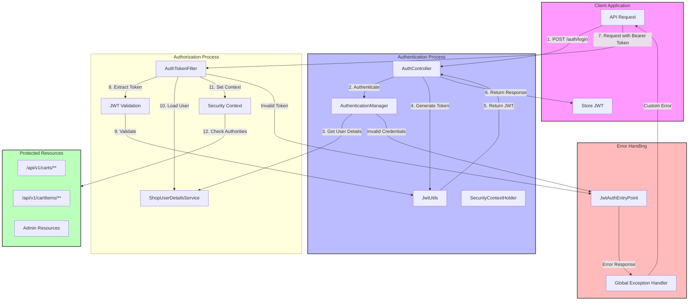
```mermaid
flowchart TD
    subgraph Client["Client Application"]
        Request[API Request]
        Token[Store JWT]
    end

    subgraph Authentication["Authentication Process"]
        Auth[AuthController]
        AM[AuthenticationManager]
        JWT[JwtUtils]
        Security[SecurityContextHolder]
    end

    subgraph Authorization["Authorization Process"]
        AF[AuthTokenFilter]
        JWTVal[JWT Validation]
        UserService[ShopUserDetailsService]
        SC[Security Context]
    end

    subgraph Protected["Protected Resources"]
        Cart["/api/v1/carts/**"]
        CartItems["/api/v1/cartItems/**"]
        Admin[Admin Resources]
    end

    subgraph ErrorHandling["Error Handling"]
        EntryPoint[JwtAuthEntryPoint]
        GlobalHandler[Global Exception Handler]
    end

%% Login Flow
    Request -->|1. POST /auth/login| Auth
    Auth -->|2. Authenticate| AM
    AM -->|3. Get User Details| UserService
    Auth -->|4. Generate Token| JWT
    JWT -->|5. Return JWT| Auth
    Auth -->|6. Return Response| Token

%% Protected Resource Access
    Request -->|7. Request with Bearer Token| AF
    AF -->|8. Extract Token| JWTVal
    JWTVal -->|9. Validate| JWT
    AF -->|10. Load User| UserService
    AF -->|11. Set Context| SC
    SC -->|12. Check Authorities| Protected

%% Error Paths
    AF -->|Invalid Token| EntryPoint
    AM -->|Invalid Credentials| EntryPoint
    EntryPoint -->|Error Response| GlobalHandler
    GlobalHandler -->|Custom Error| Request

%% Styles
    classDef client fill:#f9f,stroke:#333,stroke-width:2px
    classDef auth fill:#bbf,stroke:#333,stroke-width:2px
    classDef protected fill:#bfb,stroke:#333,stroke-width:2px
    classDef error fill:#fbb,stroke:#333,stroke-width:2px

    class Client client
    class Authentication auth
    class Protected protected
    class ErrorHandling error
```


